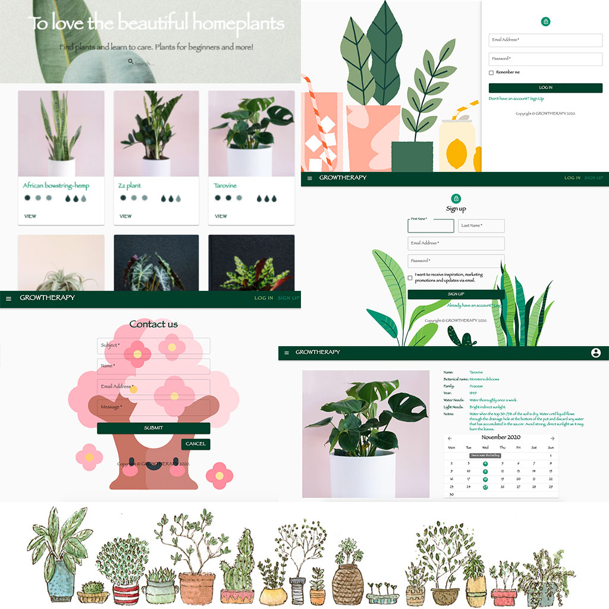
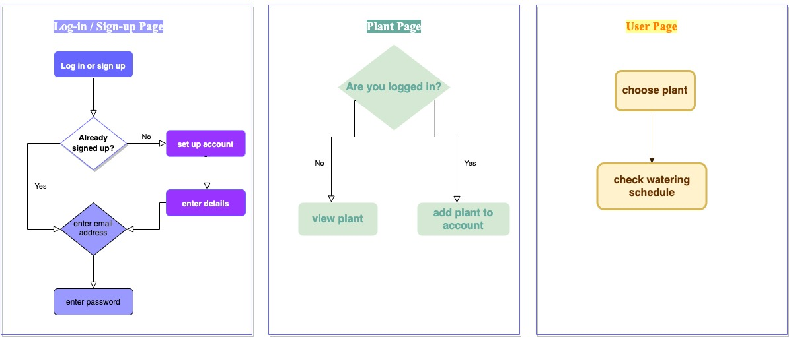
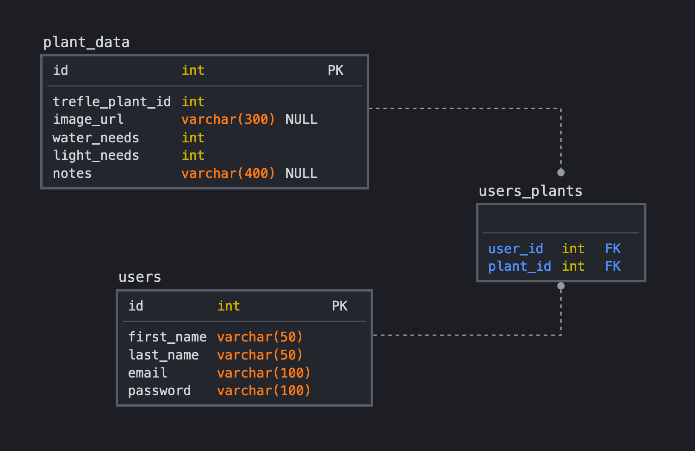
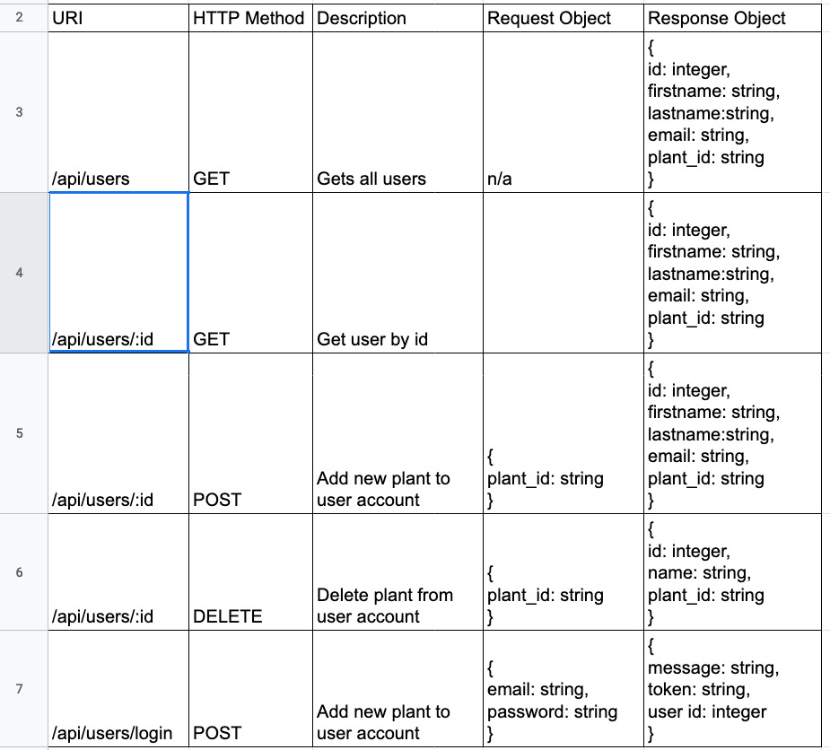

# growtherapy

Growtherapy is a full-stack application that helps you take care of your house plants. Moreover, this is an encouragement to explore and practice horticultural therapy. Features include watering, lighting conditions, care-reminder, and note-taking.



# Basic Information





## Objectives

- Use React classes and functions, Express, and SQL to build a full-stack app.
- Pass props to child components and propogate changes back up to parent components.
- Use state to respond to changes.

## Setup

Run the server:

```sh
cd server
npm install
npm start
```

Run the client:

```sh
cd client
npm install
npm start
```

## Resources

- [React documentation - tutorial](https://reactjs.org/docs/hello-world.html)
- [React-router](https://reactrouter.com/web/guides/quick-start)
- [EmailJs](https://dashboard.emailjs.com/admin)
- [MaterialUI](https://material-ui.com/)
- [Trefle-API](https://trefle.io/api/v1/species)

## Notes

_This is a student project that was created at [CodeOp](http://CodeOp.tech), a full stack development bootcamp in Barcelona._
